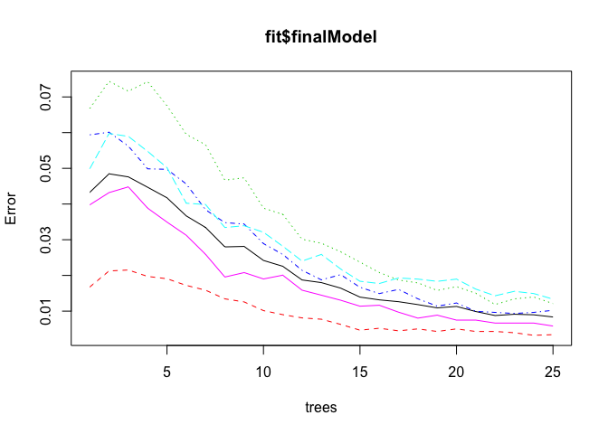

# PML Course project
Gerrit Versteeg  
20 July 2017  


## 1. Executive summary
This research makes an effort to predict how well a weight lifting exercise is performed, based on a number of movement-measures. After cleaning the training set from unnecessary variables (NA's in testing set and non-measure variables), a random forest model was fitted using 25 trees and 10-fold cross validation. This resulted in a model with a 99.1% accuracy on the training set and an out-of-bag error of 0.84%.

## 2. Loading and preparing the data

```r
library("dplyr", quietly=TRUE, warn.conflicts = FALSE)     ## for data prep
library("caret", quietly=TRUE, warn.conflicts = FALSE)     ## also loads ggplot2
urlTR <- "https://d396qusza40orc.cloudfront.net/predmachlearn/pml-training.csv"
urlTS <- "https://d396qusza40orc.cloudfront.net/predmachlearn/pml-testing.csv"
if (file.exists("./plm-training.csv")) {unlink("./plm-training.csv")}
if (file.exists("./plm-testing.csv")) {unlink("./plm-testing.csv")}
download.file(urlTR, destfile="./pml-training.csv", method="curl")
download.file(urlTS, destfile="./pml-testing.csv", method="curl")
DF_Tr <- tbl_df(read.csv("pml-training.csv"))  ## load into dataset/tibble
DF_Ts <- tbl_df(read.csv("pml-testing.csv"))   ## load into dataset/tibble
```

## 2. Data-prep and Feature Selection
The original research paper mentions the selection of 17 features (out of 96 measures) as being most relevant, but these features cannot be directly related to the 160 variables without in-depth knowledge of the measures. We will decrease the number of variables in two steps: 1) de-select all non-measurement variables (columns 1 to 7). 2) de-select all variables that have NA's in the testing set, because these have no value during the evaluation of the model to be build.

```r
## create vector of column-ids for columns having NA's or no measures
v1 <- c(1:7)                    ## init vector (first 7 column-indices)
for(i in 8:ncol(DF_Ts)){        ## for all other columns
        if (sum(is.na(DF_Ts[,i]))>0) {
                v1<-c(v1,i)
                }               ## add the index if any NA's in column
}
dfTs <- DF_Ts[,-v1]             ## keeping remaining 53 variables in testset
dfTr <- DF_Tr[,-v1]             ## keeping the same 53 variables in trainset
dim(dfTr)
```

```
## [1] 19622    53
```

Another thing to check for is the distribution of the number of samples over the outcome classes. If this is very unbalanced, training will be impaired. 

```r
## to look at possible imbalance of the number of samples for each
## outcome class:
table(DF_Tr$classe)
```

```
## 
##    A    B    C    D    E 
## 5580 3797 3422 3216 3607
```
Although class "A' is favored, the other classes are nicely distributed, so the training set does not look very unbalanced as a whole.
Also random forest cannot digest factor variables that have more than 32 levels. Looking at the structure of the resulting dataframe (dfTr) non of the remaining variables (excl. classe) is a factor variable, so that is fine.

## 3. Choosing the model
The outcome to be predicted is "classe", a factor variable (5 levels), hence this is a classification problem. The original study used 10 combined random forests each with 10 trees and 10-fold CV to avoid overfitting the model to the training set. Random forest tends to yield accurate results (next to boosting) in classification problems as stated in the lectures, so we are going to use a similar model as the one used by the original research.

A slight adaption is made to avoid generating 10 random forests and then combining them. The research suggests that we should be using 10 forests * 10 trees = 100 trees in one forest, but we will start with 25 trees in one forest to avoid lengthy computing times. Also usage was made of the excellent tips from the forum blog of Len Gerski to speed up the training process (thanks Len).


```r
## configure parallel processing
library(parallel)
library(doParallel)
cluster <- makeCluster(detectCores()-1) ## leave one for OS
registerDoParallel(cluster)
## set the trainControl object
fC <- trainControl(method="cv",number=10,allowParallel=TRUE)
## train the model
set.seed(46218)
fit <- train(classe~.,method="rf",data=dfTr,ntree=25,trcontrol=fC)
## release parallel processing cluster
stopCluster(cluster)
registerDoSEQ()
print(fit)
```

```
## Random Forest 
## 
## 19622 samples
##    52 predictor
##     5 classes: 'A', 'B', 'C', 'D', 'E' 
## 
## No pre-processing
## Resampling: Bootstrapped (25 reps) 
## Summary of sample sizes: 19622, 19622, 19622, 19622, 19622, 19622, ... 
## Resampling results across tuning parameters:
## 
##   mtry  Accuracy   Kappa    
##    2    0.9890901  0.9861974
##   27    0.9911093  0.9887524
##   52    0.9832129  0.9787614
## 
## Accuracy was used to select the optimal model using  the largest value.
## The final value used for the model was mtry = 27.
```

## 4. Evaluating the model
It has no use to split up the training set into a separate training and validation set (to subsequently test our model), because we already used 10-fold cross-validation during the training of the model. The training already took care of our validation. Therefor we can you use the accuracy and out-of-sample errors that were automatically generated during the training.

The accuracy (0.9911093 on mtry=27) listed above, was used for the final model. To check this we can use confusionMatrix, set to a mode that takes a re-sample out of the training set.


```r
confusionMatrix.train(fit)   ## .train because we don't have testset outcomes
```

```
## Bootstrapped (25 reps) Confusion Matrix 
## 
## (entries are percentual average cell counts across resamples)
##  
##           Reference
## Prediction    A    B    C    D    E
##          A 28.3  0.2  0.0  0.0  0.0
##          B  0.0 19.1  0.1  0.0  0.0
##          C  0.0  0.1 17.3  0.2  0.0
##          D  0.0  0.0  0.1 16.0  0.1
##          E  0.0  0.0  0.0  0.0 18.4
##                             
##  Accuracy (average) : 0.9911
```
The resulting average accuracy is also 0.9911. The same as the results during training.

The out-of-sample error (i.e out-of-bag error) is also relevant and is automatically generated during training as well and listed in the final model.


```r
fit$finalModel   ## .train because we don't have testset outcomes
```

```
## 
## Call:
##  randomForest(x = x, y = y, ntree = 25, mtry = param$mtry, trcontrol = ..2) 
##                Type of random forest: classification
##                      Number of trees: 25
## No. of variables tried at each split: 27
## 
##         OOB estimate of  error rate: 0.84%
## Confusion matrix:
##      A    B    C    D    E class.error
## A 5561   10    5    2    2 0.003405018
## B   22 3751   18    5    1 0.012114827
## C    1   17 3387   15    2 0.010227937
## D    0    5   32 3173    6 0.013370647
## E    0    3    7   11 3586 0.005822013
```
The out-of-bag error is approx. 0.84%

Because we used less than 100 trees, we need to check whether we used enough trees. To do so we plot the final model and look at the reduction of misclassifications while increasing the number of trees used in the model.


```r
plot(fit$finalModel)   ## to look at the error versus the number of trees
```

<!-- -->
This shows that, while going from 20 to 25 trees, not much additional error-reduction is achieved and therefor tells us that using 25 trees was sufficient to reach the needed accuracy.

## Predicting on the test set
Having an accurate model we can now make our prediction using the test set "dfTs" that we set aside in the beginning.


```r
pred <- predict(fit, dfTs)
pred
```

```
##  [1] B A B A A E D B A A B C B A E E A B B B
## Levels: A B C D E
```

These predictions function as input for the course project quiz.
So we put them in a handy format:

```r
answers <- cbind(dfTs$problem_id, as.character(pred))
if (file.exists("./answersQuiz.csv")) {unlink("./answersQuiz.csv")}
write.csv(answers, file = "./answersQuiz.csv",row.names=FALSE)
```
